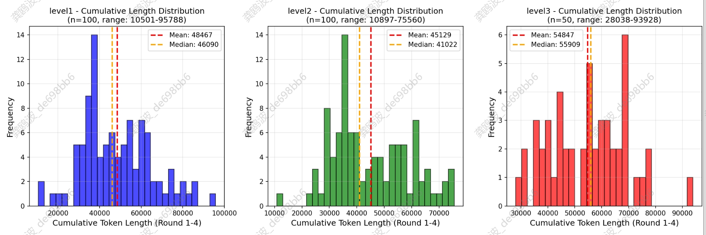
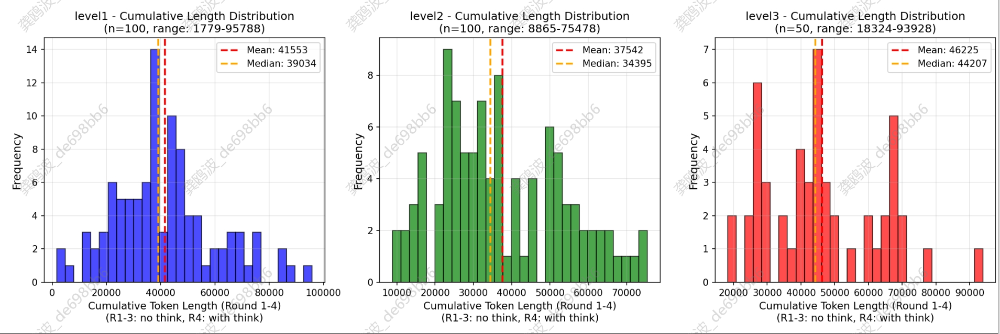

# Concur
ConCuR: Conciseness Makes State-of-the-Art Kernel Generation (Reproduced)

对ConCuR 论文的复现。

原始论文相关信息：

ConCuR: Conciseness Makes State-of-the-Art Kernel Generation

home：https://lkongam.github.io/ConCuR/

arxiv：https://arxiv.org/pdf/2510.07356

dataset：https://huggingface.co/datasets/lkongam/ConCuR

model：https://huggingface.co/lkongam/KernelCoder

# 基础环境
1台A800,使用sglang-0.5.6.post2官方镜像，或者自己准备其余的基础环境。
```shell
cd ms_swift

# 准备qwen3环境
# ms-swift==4.2.3
# transformers==4.57.1
bash env.sh

# 准备qwen3.6环境
# transformers==5.9.0
# flash-linear-attention==0.5.0
bash env_qwen3.6.sh
```

# 准备数据
下载concur数据集，然后修改ms_swist/convert_arrow_to_sft.py里面的路径，将其转换为ms-swift训练所需要的格式。由于concur论文中one-shot为给出样例，因此从训练数据从4,892选择1条数据填充到prompt template里面，剩余4891条数据作为训练数据。


训练参数：采用ms-swift作为训练框架，lora微调，rank=32，alpha=32，per_device_train_batch_size=1，梯度累积设置为2，权权重衰减设置为0.1，lora_dropout=0.05，学习率为1e-4，训练3个epoch，训练长度为3276。训练qwen3-14b，qwen3-32b，qwen3-qwq。qwen3.6-27B出现OOM，解决方案：1）安装flash-linear-attention，将训练时间从38h缩短到12h。2）设置序列并行=2，并且设置梯度累积设置为2，per_device_train_batch_size=2，确保总的训练的step和上述模型一致。如果还是OOM，则将设置序列并行=2，并且设置梯度累积设置为4，per_device_train_batch_size=1。

# 训练
```shell
# Patch swift for datasets >= 4.0 compatibility (Json feature removed)
SWIFT_CORE=$(python3 -c "import swift.dataset.preprocessor; import os; print(os.path.dirname(swift.dataset.preprocessor.__file__))")/core.py
cp /ms/FM/gongoubo/new_project/slime_project/Data_Synthesis_For_Cuda_Kernel/ms_swift/swift_core_patched.py "$SWIFT_CORE"

NPROC_PER_NODE=8 \
CUDA_VISIBLE_DEVICES=0,1,2,3,4,5,6,7 \
swift sft \
    --model /ms/FM/checkpoints/Qwen-Zoo/QwQ-32B \
    --dataset /ms/FM/gongoubo/new_project/slime_project/Data_Synthesis_For_Cuda_Kernel/ms_swift/dataset_sft_from_arrow.parquet \
    --tuner_type lora \
    --lora_rank 32 \
    --lora_alpha 32 \
    --lora_dropout 0.05 \
    --max_length 32768 \
    --sequence_parallel_size 2 \
    --per_device_train_batch_size 1 \
    --gradient_accumulation_steps 4 \
    --num_train_epochs 2 \
    --learning_rate 1e-4 \
    --warmup_ratio 0.05 \
    --weight_decay 0.1 \
    --optim adamw_torch \
    --output_dir ./output/qwen_qwq  \
    --deepspeed zero3 \
    --torch_dtype bfloat16 \
    --fp16 false \
    --bf16 true \
    --save_steps 100000 \
    --eval_steps 100000 \
    --logging_steps 10
```
transformers的qwen.py可能会报错，可以将qwen.py替换掉transformers里的qwen.py。另外dataset也可能会报错，替换掉swift里面的swift_core_patched.py。如果还有其余额外的错误，可以利用ai codeing进行修复。

# 测试
采用sglang部署除了qwen3.6-27B的模型，实测发现vllm-0.19.0部署测试的结果比sglang-0.5.6部署的QwQm模型效果要差得多。采用vllm-0.19.0部署qwen3.6-27b。

合并lora权重：
```shell
swift export \
    --model /ms/FM/checkpoints/Qwen-Zoo/QwQ-32B \
    --adapters /ms/FM/gongoubo/new_project/slime_project/Data_Synthesis_For_Cuda_Kernel/ms_swift/output/qwen_qwq_ours/v1-20260528-021748/checkpoint-940 \
    --merge_lora true \
    --output_dir /ms/FM/gongoubo/new_project/slime_project/Data_Synthesis_For_Cuda_Kernel/ms_swift/models/Qwen-QWQ-ours \
    --safe_serialization true
```

部署指令：
```shell
CUDA_VISIBLE_DEVICES=0,1,2,3 SGLANG_ALLOW_OVERWRITE_LONGER_CONTEXT_LEN=1 python3  -m sglang.launch_server \
--model KernelCoder-Qwen36-27B \
--model-path /ms/FM/checkpoints/Qwen-Zoo/QwQ-32B \
--tp-size 4 \
--context-length 40960 \
--trust-remote-code  \
--port 11378 \
--host 0.0.0.0 \
--dtype bfloat16

CUDA_VISIBLE_DEVICES=0,1,2,3 VLLM_ALLOW_LONG_MAX_MODEL_LEN=1 vllm serve /ms/FM/checkpoints/Qwen-Zoo/Qwen3.6-27B \
--tensor-parallel-size 4 \
--max-model-len 40960 \
--host 0.0.0.0 \
--port 11378

```
SGLANG_ALLOW_OVERWRITE_LONGER_CONTEXT_LEN和VLLM_ALLOW_LONG_MAX_MODEL_LEN这两个参数用于在部署服务的时候可以指定超过模型最大长度的数值。

测试：我们使用kernnelbench来测试模型的性能。注意要下载kernnelbench的数据。
```python
# ============================================================
# Defaults (overridable via CLI)
# ============================================================
API_PARAMS = {
    "url": "http://xx.xx.xx.xx:11378/v1",
    "api_key": "none",
    "model_id": "/ms/FM/checkpoints/Qwen-Zoo/QwQ-32B",
    "temperature": 1.0,
    "max_tokens": 32768,
}

# ============================================================
# Concurrency Configuration
# ============================================================
NUM_THREADS = 8
NUM_GPUS = 8
OUTPUT_DIR = "data/kernelbench_results_qwen-qwq-test"
KB_DIR = "/ms/FM/gongoubo/new_project/slime_project/Data_Synthesis_For_Cuda_Kernel/KernelBench/KernelBench"
KB_LEVELS = ["level1", "level2", "level3"]
```
采用并发加速推理，每张卡上每次只运行一个实例。另外我们也扩展了评测使用多轮反馈迭代的方式，可以和多轮强化学习的结果进行对比。

# 单轮结果
| Model | LEVEL1 |  |  | LEVEL2 |  |  | LEVEL3 |  |  |
|---------|---------:|---------:|---------:|---------:|---------:|---------:|---------:|---------:|---------:|
|  | Compile | Accuracy | Fast₁ | Compile | Accuracy | Fast₁ | Compile | Accuracy | Fast₁ |
| QwQ-32B-Paper | / | 18 | 7 | / | 17 | 11 | / | / | / |
| KernelCoder-32B-paper | / | 58 | 17 | / | 59 | 39 | / | / | / |
| Kevin-32B-paper | / | 50 | 16 | / | 46 | 27 | / | / | / |
| KernelCoder-32B | 74 | 48 | 25 | 71 | 53 | 45 | 62 | 44 | 20 |
| Kevin-32B | 69 | 43 | 22 | 59 | 19 | 8 | 25 | 0 | 0 |
| Qwen-QwQ | 50 | 41 | 20 | 53 | 42 | 37 | 26 | 16 | 8 |
| Qwen3.6-27B | 74 | 47 | 25 | 83 | 50 | 48 | 49 | 26 | 10 |
| Qwen3-14B-SFT | 68 | 40 | 26 | 74 | 37 | 33 | 44 | 28 | 12 |
| Qwen3-32B-SFT | 68 | 39 | 25 | 74 | 52 | 49 | 46 | 24 | 10 |
| Qwen-QwQ-SFT | 79 | 49 | 16 | 74 | 52 | 41 | 54 | 32 | 18 |
| Qwen3.6-27B-SFT | 59 | 45 | 25 | 80 | 53 | 53 | 72 | 56 | 20 |

几个关键点：
- QwQ-32B-Paper的结果比较低。可能和使用vllm部署推理有关，因为对比sglang部署评测的，实际会高很多。
- 也下载了Kevin-32B模型同步进行测试，效果也不大好。
- 使用concur数据集训练后的模型在kernnelbench上确实取得了一致性的提升。

# 多轮结果
|             |        |            | LEVEL1  |          |       |            | LEVEL2  |          |       |            | LEVEL3  |          |       |
| ----------- | ------ | ---------- | ------- | -------- | ----- | ---------- | ------- | -------- | ----- | ---------- | ------- | -------- | ----- |
| Model       | round  | 实际样本数 | Compile | Accuracy | Fast₁ | 实际样本数 | Compile | Accuracy | Fast₁ | 实际样本数 | Compile | Accuracy | Fast₁ |
| Qwen3.6-27B | 1      | 100        | 73      | 39       | 18    | 100        | 77      | 50       | 22    | 50         | 56      | 38       | 6     |
|             | 2      | 98         | 76.5    | 46.9     | 25.5  | 99         | 93.9    | 63.6     | 41.4  | 50         | 68      | 32       | 8     |
|             | 3      | 97         | 76.3    | 45.4     | 24.7  | 99         | 85.9    | 65.7     | 40.4  | 50         | 64      | 42       | 12    |
|             | 4      | 95         | 74.7    | 48.4     | 27.4  | 99         | 86.9    | 70.7     | 51.5  | 50         | 68      | 46       | 14    |
|             | best   | 100        | 96      | 67       | 45    | 100        | 99      | 91       | 72    | 50         | 98      | 72       | 30    |
|             | single | 100        | 59      | 45       | 25    | 100        | 80      | 53       | 53    | 50         | 72      | 56       | 20    |
| MiniMax-2.5 | 1      | 100        | 65      | 42       | 18    | 100        | 70      | 47       | 32    | 50         | 34      | 20       | 6     |
|             | 2      | 100        | 70      | 31       | 9     | 100        | 66      | 31       | 20    | 50         | 44      | 12       | 2     |
|             | 3      | 100        | 62      | 28       | 12    | 100        | 72      | 34       | 22    | 50         | 52      | 22       | 6     |
|             | 4      | 100        | 64      | 33       | 16    | 100        | 81      | 41       | 21    | 50         | 54      | 22       | 6     |
|             | best   | 100        | 92      | 59       | 34    | 100        | 96      | 75       | 58    | 50         | 80      | 44       | 14    |

需要注意的是：

- qwen3.6-27B在推理的时候对于多轮数据，前面几轮的think会被丢掉。

```python
from openai import OpenAI

# ============================================================
# Defaults (overridable via CLI)
# ============================================================
API_PARAMS = {
    "url": "http://192.168.112.57:11378/v1",
    "api_key": "none",
    "model_id": "/ms/FM/checkpoints/Qwen-Zoo/Qwen3.6-27B",
    "temperature": 1.0,
    "max_tokens": 32768,
}

openai_client = OpenAI(base_url=API_PARAMS["url"], api_key=API_PARAMS["api_key"])

messages = [
    {"role": "user", "content": "你是谁？"},
    {"role": "assistant", "content": "<think>\n我需要回答用户我是谁。\n</think>\n\n我是Qwen，你需要我做什么？"},
    {"role": "user", "content": "1+1等于几？"}
]

from transformers import AutoTokenizer
tokenizer = AutoTokenizer.from_pretrained(API_PARAMS["model_id"])
inps = tokenizer.apply_chat_template(messages, add_generation_prompt=True, tokenize=True)
print(len(inps.input_ids))
```

如果需要保留，请参考：https://huggingface.co/Qwen/Qwen3.6-27B

另外，ms-swift训练的时候：https://swift.readthedocs.io/en/v3.12/Instruction/Command-line-parameters.html?utm_source=chatgpt.com

Note: For thinking models (thinking/hybrid thinking) or when enable_thinking is explicitly enabled, we will remove historical thinking content during both inference and training (the thinking content of the last round is retained, i.e., the content after the last user message). If the basic strategy of loss_scale during training is not last_round, for example ‘default’, then historical thinking content will not be removed.

loss_scale 默认是default，也就是训练的时候多轮的中的think会被保留且会被用于训练计算loss。

qwen3.6-27B多轮推理结果数据分布：



